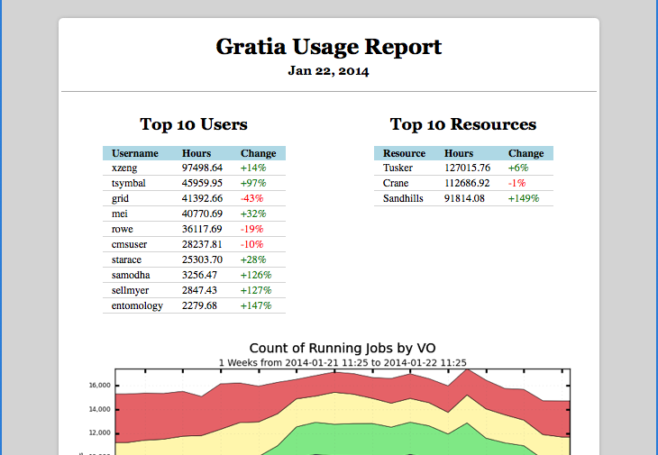

.. Usage Report documentation master file, created by
   sphinx-quickstart on Thu Jan 23 13:31:20 2014.
   You can adapt this file completely to your liking, but it should at least
   contain the root `toctree` directive.

Welcome to Usage Report's documentation!
========================================

Usage Reports are used to provide insight to what is happening at HPC Centers.

Contents:

.. toctree::
   intro
   installation
   :maxdepth: 2

Indices and tables
==================

* :ref:`genindex`
* :ref:`search`

